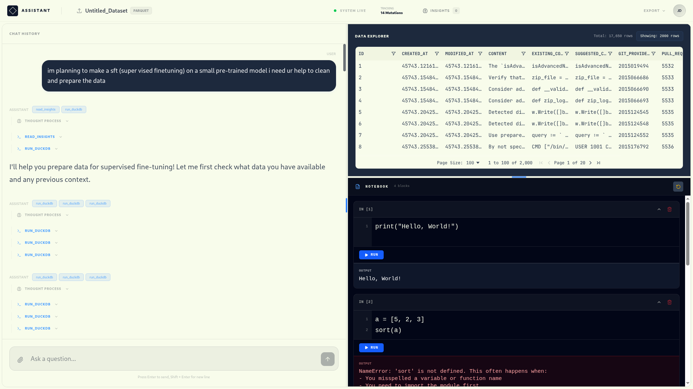

# DataRover

DataRover is an AI-powered data analysis workspace designed to bring advanced data querying, visualization, and Python execution directly to your browser. By combining in-browser data engines, an embedded Python sandbox, and AI assistance, it enables users to seamlessly explore and analyze their datasets in a unified environment.



## 🔑 Demo Credentials

To quickly test the deployed application, use the following credentials:
- **Email:** `john@email.com`
- **Password:** `123456`

## 🚀 Core Features

- **Interactive Workspaces:** Secure, isolated environments for individual datasets where you can maintain chat histories, code blocks, and data insights.
- **Client-Side Data Engine:** Powered by **DuckDB-WASM**, DataRover parses and queries large datasets (CSV, Excel, Parquet) entirely in the browser using SQL, offering blazing fast performance.
- **Python Code Notebook:** Features an embedded **Pyodide sandbox** allowing you to execute Python data science scripts directly within the workspace.
- **AI Data Assistant:** Integrated with the **Vercel AI SDK**, the assistant can autonomously analyze your schema, write and execute SQL queries, generate Python code, and extract meaningful insights.
- **Cloud Storage & Sync:** Datasets are securely stored using **Supabase**, while user data, conversations, and workspace metadata are persisted in **Neon (Serverless Postgres)** using **Drizzle ORM**.

## 🛠️ Tech Stack

- **Framework:** React 19, Vite, TanStack Router & TanStack Start
- **State Management:** Zustand
- **Styling:** Tailwind CSS v4, Lucide React
- **Data Engine (Browser):** DuckDB-WASM (`@duckdb/duckdb-wasm`)
- **Python Sandbox (Browser):** Pyodide
- **Database / ORM:** Neon (PostgreSQL), Drizzle ORM
- **File Storage:** Supabase Storage
- **AI Integration:** Vercel AI SDK (with OpenAI/Groq compatibility)
- **Data Parsing:** SheetJS, Apache Arrow, ParquetJS

## 📂 Project Structure

- `src/routes/` - File-based routing setup managed by TanStack Router (includes Authed Workspaces).
- `src/components/` - Reusable UI components including the `DataPreview` grid, `CodeNotebook`, and Chat `History`.
- `src/db/` - Database schema definitions leveraging Drizzle ORM.
- `src/store/` - Zustand stores for modular state management (`duckdb.ts`, `sandbox.ts`, `notebook.ts`, `conversation.ts`, etc.).
- `src/utils/` - Shared utilities, including server-side functions (`*.server.ts`) for secure operations.

## 🏃‍♂️ Getting Started

### Prerequisites
- [Bun](https://bun.sh/) installed on your machine.
- Environment variables configured for Supabase, Neon DB, and your preferred AI provider.

### Installation

1. Install dependencies:
   ```bash
   bun install
   ```

2. Start the development server:
   ```bash
   bun run dev
   ```
   *The server will start on port 3000.*

### Building and Testing
- **Build for Production:** `bun run build`
- **Run Tests:** `bun run test` (Powered by Vitest)

## 🎨 UI & Code Style

- Enforces strict TypeScript configuration.
- Follows modular Zustand store patterns (separating UI state, data, and actions).
- Utilizes `requestAnimationFrame` for batched UI updates during AI streaming for maximum performance.
- Database relations mapped via `drizzle-orm/relations`.